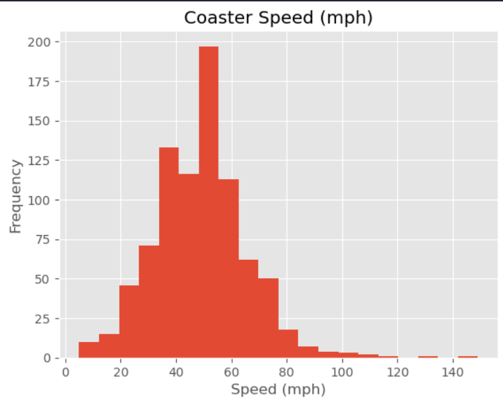

# EDA_RollerCoaster_Data_Analysis

## Introduction
In this project, this focuses on the **Exploratory Data Analysis (EDA)**, and it is analyzed with a given data about the roller coasters from around the world *(coaster_db.csv)*. 
This project is guided by a YouTube Channel: [Rob Mulla](https://www.youtube.com/watch?v=xi0vhXFPegw&ab_channel=RobMulla) to help us give a better understanding and gain
experience in the process of EDA. 

## Tech Stack
1. Visual Studio Code
2. Jupyter Notebook
3. Python (Pandas, NumPy, Matplotlib, & Seaborn)

## Features
This project contains the process of exploratory data analysis of roller coasters such as how we try read our given CSV file, data cleaning, data manipulation, and data visualization
to show our findings of our given dataset. 

## Process
### DataFrame Understanding
After creating our Jupyter Notebook file, we try to read our dataFrame by reading our roller coaster CSV file, but the file has 56 columns that our dataFrame cannot
read nor print out all columns. So we use Pandas to set display to max the number of columns, for which we can print out our dataFrame with all columns into a single cell of the notebook. 
We start by understanding our dataFrame by defining its shape (1087 rows and 56 columns), print out the head and tail of the dataFrame, print out the names of the columns, data types of each columns, 
dataFrame information of each columns, and dataFrame's statistical summary of each column. 

### DataFrame Preparation
For data preparation, we drop columns that we think that it is necessary for our data analysis. We kept the 
columns names of *coaster_name, location, status, Manufacturer, year_introduced, latitude, longitude, Type_Main, opening_date_clean, speed_mph, height_ft, Inversion_clean, & Gforce_clean* for our data analysis.
After dropping columns, we checked our dataFrame's shape and data types to see if we need to change our data type such as *opening_date_clean* should change into *datetime* instead of *object* data type, and we 
renamed our columns. Finally, we check for null and duplicated values in our dataFrame before we start analyzing our data.
 
### Feature Understanding
We start our findings by looking at how many roller coaster were in introduced by year, so we use the *value_counts()* to 
calculate the total number of roller coasters by year in a descending order. We create our first data visualization of a histograme to show the *Top 10 Years Roller Coasters Introduced*, and we saw that
the year 1999 and 2000 had the highest amount of roller coasters were introduced. Next, we want to find the distribution of speed (mph) from roller coasters, so we create 
a histogram plot of the distribution of roller coaster's speed. We saw that our histogram is right-skewed and the most frequency of roller coaster's speed is somewhere between 35-65 miles per hour. 
Finally, we want to find the density of the roller coaster's speed (mph) by create a line chart, for which we saw that the highest density is at the speed of 50 miles per hour.

### Feature Relationship
We start by finding relationship in our dataFrame, so we first look at the relationship between the height (*Height_ft*) and speed (*Speed_mph*) of the roller coasters by using a scatter plot. We find that the 
increase of height, then the increase of the roller coaster's speed, but this is only a correlation, not a causation such as some outliers have lower height but with faster speed. 
We made a similar data visual with an added feature to show where these roller coasters were introduced. We saw that most roller coasters with the high speed and increase high are mostly in the year 2000;
it might be because of increase of technology and safety features for the roller coasters. 
Next, we create a pair plot to show our selected columms of *Year_Introduced, Speed_mph, Height_ft, Inversions, & Gforce*, so we can
see the relationship between those selected columns. We even create a correlation of the selected columns, so that we can create a heat map for our data 
visualization. We asked ourselves a question is *What are the top 10 fastest roller coasters*? We create a query to group by location, aggregate the roller coaster's speed by mean and count, and query where the 
count is greater than 10 and sort values by mean. Then we create a horizontal histogram to show the top 10 roller coasters with the average speed.  

## Learning
I learned during the process of create a data visualization is how to group data visuals between feature understanding and feature relationship,
so that we can help guide our audience to show what the data visuals are trying to tell us from our data. 

## Improvement
Utilizing to documenting our finding and separate between understanding and relationship for our data visualization.

## Running the Project
You can download the *marathon.ipynb* file, and run it on either Jupyter Notebook, Visual Studio
Code (require Jupyter Notebook extension), and Google Colab.

